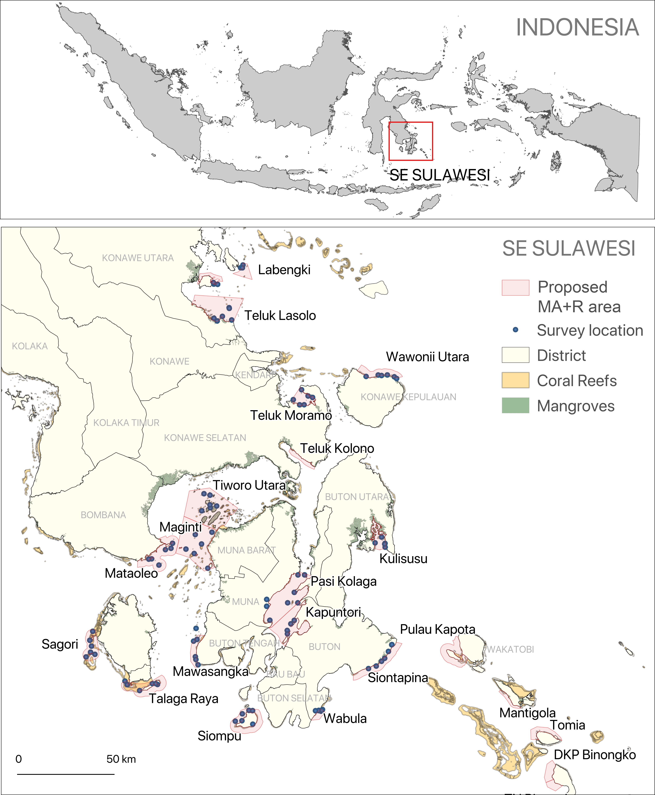

\begin{aligned}
Report generated on: `r format(Sys.Date(), "%B %d, %Y")`
\end{aligned}

#### SUMMARY

{*include a sumary based on the results of this report*}
 
\newpage

#### INTRODUCTION

The ecological monitoring data report provides a basic analysis and interpretation of ecological data collected in coral reefs to detect changes in managed access and reserves (MA+R) across national and subnational levels. Results from ecological monitoring are critical for evaluating trends in ecosystem health and coastal fisheries, and for providing high quality data for decision-making to achieve effective and adaptive management. The ultimate objective of ecological monitoring is to assess the effectiveness of the MA+R approach in increasing fish populations and improving ecosystem health.

#### METHODOLOGY

Underwater surveys were conducted through partner universities and local organizations to characterize the marine and coastal ecosystems inside and outside of the MA+R areas. Selected fish and benthic species were recorded within representative survey areas, allowing for estimates of fish biomass and abundance, fish size structure and diversity, percent habitat cover, functional habitat diversity.

#### *Survey Locations*

We surveyed {*include number of MA+R selected*} managed access and reserves across {*include administrative level*}.

```{r map, echo=FALSE, fig.height=9, fig.width=9, dpi=300, message=FALSE, warning=FALSE, paged.print=FALSE}
if("Location Map" %in% input$locationmap) plot_map()
  
```


**Figure**. Location of ecological surveys across SE Sulawesi. Proposed MA+R are highlighted in red, survey locations are in blue.

#### *Fish Surveys*
    
We used underwater visual census (UVC) to monitor reef fish assemblages. 

#### *Benthic Surveys*

#### *Data Analysis*

#### RESULTS AND DISCUSSIONS

```{r fish_biomass, echo=FALSE, fig.height=9, fig.width=9, dpi=300, message=FALSE, warning=FALSE, paged.print=FALSE}
if("Fish Biomass" %in% input$metrics) plotFishBiomass()
```

**Figure**. Average fish biomass (± 95% confidence interval) in kg/ha

```{r fish_density, echo=FALSE, fig.height=9, fig.width=9, dpi=300, message=FALSE, warning=FALSE, paged.print=FALSE}
if("Fish Density" %in% input$metrics) plotFishDensity()
```

**Figure**. Average fish density (± 95% confidence interval) in individuals/ha

```{r fish_size, echo=FALSE, fig.height=9, fig.width=9, dpi=300, message=FALSE, warning=FALSE, paged.print=FALSE}
if("Fish Size Structure" %in% input$metrics) plotFishSize()
```

**Figure**. Size structure (total length in cm) for most common species

```{r fish_diversity, echo=FALSE, fig.height=9, fig.width=9, dpi=300, message=FALSE, warning=FALSE, paged.print=FALSE}
if("Fish Diversity" %in% input$metrics) plotFishDiversity()
```

**Figure**. Averege number of fish species (± 95% confidence interval).

```{r hardcoral_cover, echo=FALSE, fig.height=9, fig.width=9, dpi=300, message=FALSE, warning=FALSE, paged.print=FALSE}
if("Hard Coral Cover" %in% input$metrics)  plot_hardcoral.cover()
```

**Figure**. Averege coverage of hard corals (± 95% confidence interval).

```{r hardcoral_diversity, echo=FALSE, fig.height=9, fig.width=9, dpi=300, message=FALSE, warning=FALSE, paged.print=FALSE}
if("Habitat Diversity" %in% input$metrics) plot_benthic.diversity()
```

**Figure**. Average number of benthic groups (± 95% confidence interval).


#### CONCLUSIONS

```{r, echo=FALSE}

```

For more information check the [Rare Data Portal](https://portal.rare.org/program-data/impacts/ecological-impacts/fisheries-recovery/ecological-data/)